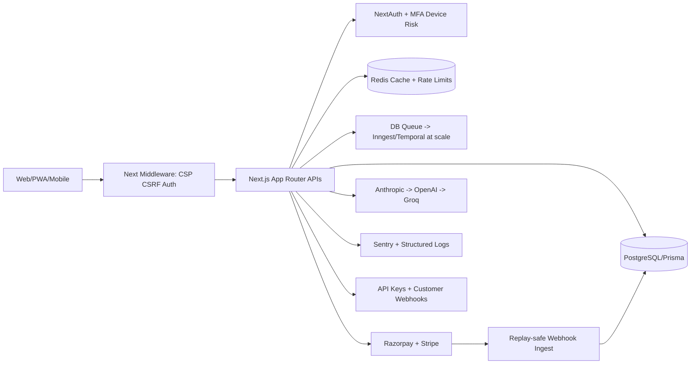

# SplitSmart Final Enterprise Gap Analysis

## Executive Status

Status: **enterprise beta ready, not unrestricted global GA**.

SplitSmart now has the core production, fintech, SaaS, growth, and compliance foundations needed to run a controlled paid launch. The remaining gaps are mostly external integrations and governance programs that cannot be completed inside application code alone: SOC2 evidence collection, PCI scope review, live tax registration, PagerDuty/Opsgenie accounts, Terraform cloud credentials, mobile store packaging accounts, and multi-region database operations.

## Severity Matrix

### Critical

- Production DB migration must be planned and rehearsed before deploying the expanded schema.
- Payment-provider sandbox and live webhook replay tests must pass for Razorpay and Stripe.
- Email verification flow must be completed before enforcing payments for unverified accounts at scale.
- Legal review is required for refund, privacy, PCI, tax, and international payment language.
- Docker build could not be validated unless Docker daemon is running in CI.

### High

- SOC2 control owners, evidence cadence, and access reviews must be assigned.
- Tax/GST/VAT engine remains policy-ready but provider integration is not implemented.
- Enterprise SSO/SCIM are schema/architecture roadmap items, not live integrations.
- OpenTelemetry/PagerDuty are documented as integration points but require vendor keys.
- Recharts prerender warnings should be resolved for zero-noise builds.

### Medium

- Middleware should migrate to Next.js `proxy` convention.
- Sentry config deprecations should be updated.
- Queue runner is DB-backed and adequate for early scale, but should move to Inngest/Temporal/BullMQ beyond 50k active users.
- AI fallback supports Anthropic/OpenAI/Groq but streaming UI is not wired.
- Customer webhooks and public API are foundation endpoints; developer portal UI is still needed.

### Low

- White-label theming, app store packaging, and advanced experimentation dashboards are roadmap items.
- Chaos testing and synthetic checks need CI/CD scheduled execution.

## Systems Implemented In This Pass

- CSRF protection with same-origin validation and double-submit token fallback.
- Hardened CSP with `base-uri`, `form-action`, `frame-ancestors`, and `object-src`.
- Device fingerprinting, risk events, disposable email detection, and IP prefix blocking.
- MFA data model, recovery code storage, trusted/revoked devices, and session revocation foundations.
- API key model, secure key generation, hashed storage, scoped verification, and `/api/v1/groups`.
- Customer webhook registration model and endpoints.
- DB-backed queue with retries, exponential backoff, and dead-letter status.
- Feature flag and deterministic rollout foundation.
- Compliance policy versioning and user acceptance tracking.
- Workspace/seat-billing data model for enterprise accounts.
- AI fallback chain across Anthropic, OpenAI, and Groq with caching and usage logging.
- Growth/revenue event scaffolding and pricing experiment bucketing.
- Final production readiness and enterprise gap reports.

## Architecture Diagram

## Rollout Strategy

1. Deploy schema to staging and run migration dry-run.
2. Enable CSRF in monitor mode for 24 hours by reviewing 403s.
3. Enable disposable email/IP reputation blocking for signup only.
4. Enable verified-email requirement for payment initiation after email verification UX is live.
5. Enable API keys for internal/test customers first.
6. Run payment reconciliation in read-only mode for one billing cycle.
7. Enable customer webhooks for Team plan after retry metrics are stable.
8. Promote to enterprise beta with 5 to 10 design partners.

## Launch Checklist

- Production env vars provisioned and rotated into a secrets manager.
- Database migration backup taken and restore tested.
- `/api/health` returns healthy in production.
- Razorpay and Stripe webhook replay tests pass.
- Sentry receives tagged production test errors.
- Redis rate limits active.
- Unit tests, typecheck, lint, and build pass in CI.
- Legal pages reviewed and versioned in `CompliancePolicy`.
- Refund and chargeback owner assigned.
- Incident commander and escalation rotation assigned.

## Post-Launch Monitoring Checklist

- Payment success rate above 97%.
- Webhook failure rate below 0.5%.
- API p95 latency below 500 ms for authenticated routes.
- Signup-to-first-group conversion above 45%.
- First-group-to-first-expense conversion above 60%.
- Trial/Free-to-Pro conversion above 3%.
- Failed payment recovery above 25%.
- AI cost below 8% of MRR.
- Error budget burn monitored daily.

## Scaling Roadmap

### 100 users

- Vercel Hobby/Pro, managed Postgres, Upstash Redis, Sentry free/team.
- DB-backed jobs are acceptable.
- Manual finance reconciliation weekly.

### 10k users

- Vercel Pro, Neon/Supabase pooled Postgres, Redis paid tier.
- Add read replica for analytics.
- Move notifications and billing retries to Inngest/BullMQ.
- Add uptime checks and PagerDuty.

### 100k users

- Dedicated Postgres with PITR, PgBouncer, read replicas.
- Partition `AuditLog`, `UsageEvent`, `WebhookEvent`, `Notification` by month.
- Customer webhooks run through durable queue.
- CDN image optimization and region-aware edge cache.

### 1M users

- Multi-region app serving, primary DB with regional read replicas.
- Dedicated event pipeline for analytics.
- Temporal/Inngest for billing, dunning, webhooks, and notification orchestration.
- Data warehouse for revenue/churn models.
- Enterprise SSO/SCIM and audit export by default.

## Monthly Infrastructure Cost Estimate

| Stage | Users | Infra Estimate | Components |
| --- | ---: | ---: | --- |
| Seed | 100 | $75/mo | Vercel Pro seat, managed Postgres starter, Redis free/low tier, Sentry starter |
| Launch | 10k | $650/mo | Vercel Pro, Postgres pooled compute + backups, Redis paid, Sentry team, email volume |
| Growth | 100k | $4,800/mo | Dedicated Postgres, read replica, Redis HA, queue provider, Sentry/OTel, email/push volume |
| Scale | 1M | $38,000/mo | Multi-region app, dedicated DB cluster, replicas, warehouse, queues, observability, CDN |

## Revenue Scaling Model

Assumptions:

- Pro price: ₹299/mo, approximate $3.60/mo.
- Team price: ₹999/mo, approximate $12/mo.
- Blended paid ARPA target: $5/mo early, $7/mo at scale with Team mix.

| Target | Required Paid Accounts | Example Mix |
| --- | ---: | --- |
| $2k MRR | 400 paid at $5 ARPA | 330 Pro + 70 Team |
| $10k MRR | 1,670 paid at $6 ARPA | 1,350 Pro + 320 Team |
| $100k MRR | 14,300 paid at $7 ARPA | 10,500 Pro + 3,800 Team |

Growth levers:

- Referral loop: reward both inviter and invitee with 1 month Pro after invitee creates a group and records 3 expenses.
- Upgrade triggers: group limit, monthly expense limit, AI receipt OCR, WhatsApp reminders, analytics export.
- Dunning: failed payment email immediately, WhatsApp day 1, in-app banner day 2, card update CTA day 3, grace expires day 7.
- Retention: weekly settlement digest, upcoming subscription renewals, streak rewards, low-usage subscription savings.

## SOC2 / OWASP / PCI Readiness TODO

- [ ] Map controls to owner, evidence source, and review cadence.
- [ ] Quarterly access review for DB, Vercel, GitHub, payment providers, Sentry.
- [ ] Annual penetration test before enterprise GA.
- [ ] OWASP Top 10 checklist in CI issue template.
- [ ] PCI SAQ-A review because card data is handled by Stripe/Razorpay hosted flows.
- [ ] Secret rotation runbook tested quarterly.
- [ ] Immutable audit export to write-once storage.
- [ ] Vendor risk assessment for AI, payments, email, hosting, Redis, and observability.

## Zero-Downtime Migration Procedure

1. Add nullable columns and new tables.
2. Deploy application that writes both old and new paths where needed.
3. Backfill asynchronously.
4. Add constraints/indexes concurrently.
5. Flip reads to new paths.
6. Remove old columns only in a later deploy.

## Final Investor / YC Readiness Position

SplitSmart is now credible for a controlled paid beta: secure-by-default request flow, payment idempotency, webhook replay protection, risk foundations, plan enforcement, compliance pages, growth metrics, and scaling runbooks exist. It is not yet SOC2-certified or PCI-reviewed, but the engineering substrate is ready for those programs.
